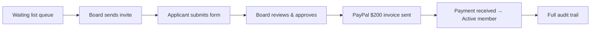
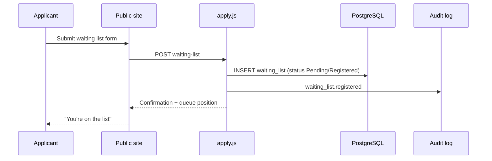
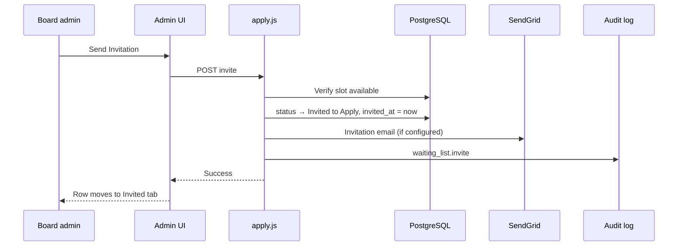
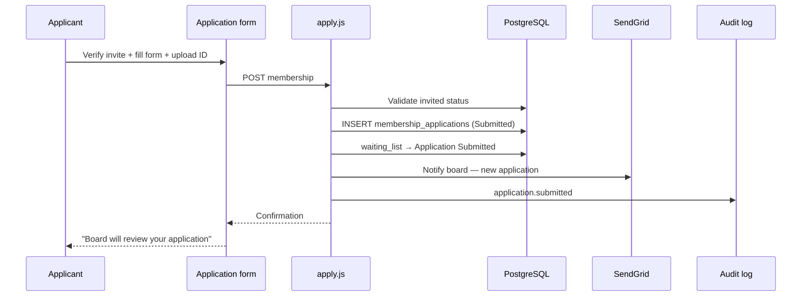
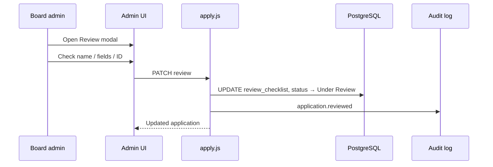
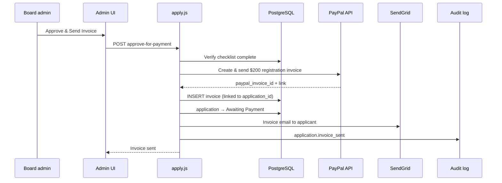
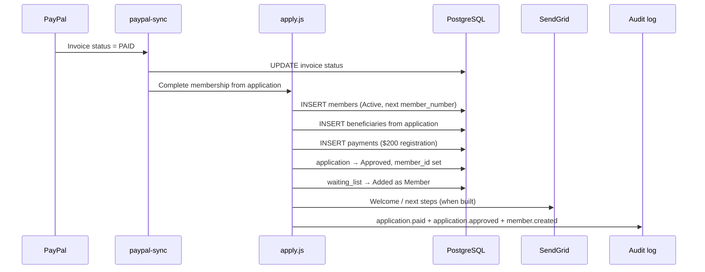

# Hibret Edir — Membership Onboarding Workflow

**Purpose:** Board reference, agent handoff, and public-facing description of how new members join Hibret Edir through the automated platform.

**Status:** **Live workflow** (June 2026). PayPal invoice on board approve; membership created when payment is confirmed (PayPal sync or board mark-paid).

**Related:** `Context.md` · `db/schema.sql` (`waiting_list`, `membership_applications`, `members`, `invoices`, `audit_log`) · `netlify/functions/apply.js`

---

## At a glance

Hibret Edir caps membership at **200 active members**. New families join through a **waiting list → invitation → application → board review → $200 registration payment → active membership** pipeline. Every step is tracked in the database and **audit log** so the board always knows who is where in the process.



---

## Why this workflow

| Principle | What it means |
|-----------|----------------|
| **Vet before billing** | No PayPal invoice until the board confirms name, application, and ID. |
| **Pay before membership** | Nobody is added to the active member database until the $200 registration fee is received. |
| **Slots are protected** | Invited and in-progress applicants count against open slots so the board never over-invites. |
| **Everything is logged** | Invites, submissions, reviews, invoices, and membership creation write to the activity log. |

---

## Roles

| Role | Responsibility |
|------|----------------|
| **Applicant / family** | Join waiting list, respond to invite, complete application, pay registration fee. |
| **Board admin** | Send invitations, review applications, approve vetted applicants (triggers invoice), handle edge cases (Zelle, rejections). |
| **System** | Queue ordering, slot math, notifications, PayPal invoice, payment detection, member creation, audit trail. |

---

## End-to-end journey (plain language)

1. A family joins the **public waiting list** (name, contact, address).
2. When a membership slot opens, the board **sends an invitation** from the admin Waiting List.
3. The applicant completes the **full membership application** (family, beneficiary, ID upload).
4. The application appears on the board **Applications** tab for review.
5. When the board is satisfied (name matches waiting list, fields complete, ID verified), they **approve and send the $200 PayPal invoice**.
6. When **payment arrives** (PayPal sync or board mark-paid for Zelle), the system **creates the active member record**, links the application, and marks the waiting list entry as **Added as Member**.
7. The new member can set up **portal access** (phone + PIN) and participate in Edir events under the **4-month waiting period** rule for benefits.

---

## Automation flows by trigger

Each section below is one **trigger** — something that happens in the real world — and everything the platform does in response.

---

### Trigger 1 — Someone joins the waiting list

**Starts when:** Applicant submits the public waiting list form (`POST apply/waiting-list`).



| | |
|---|---|
| **Waiting list status** | `Registered` or `Pending` |
| **Board action** | None — monitor queue on **Waiting List → All** |
| **Public site** | Name may appear on public waiting list status (privacy rules apply) |
| **Automated** | Duplicate email/phone checks, queue ordering by `applied_at` |
| **Logged** | Registration event; notes on waiting list row |

---

### Trigger 2 — Board sends invitation

**Starts when:** Board clicks **Send Invitation →** on an eligible waiting list row (`POST apply/waiting-list/:id/invite`).

**Eligibility:** Person must be in the queue **and** within open slots (`MEMBER_CAP − active members − already invited/applying`).



| | |
|---|---|
| **Waiting list status** | `Invited to Apply` |
| **Board sees** | **Waiting List → Invited** |
| **Applicant receives** | Email with link to `/application/` to verify identity |
| **Slot impact** | Counts as **in pipeline** — holds a slot until resolved |
| **Logged** | `waiting_list.invite` + timestamped note on row |

---

### Trigger 3 — Applicant submits membership application

**Starts when:** Invited applicant completes the form at `/application/` (`POST apply/membership`).

**Gate:** Waiting list row must be `Invited to Apply` (not merely on the queue).



| | |
|---|---|
| **Application status** | `Submitted` |
| **Waiting list status** | `Application Submitted` |
| **Board sees** | **Applications → Pending**; **Waiting List → In Progress** |
| **PayPal** | **No invoice yet** — board must review first |
| **Logged** | `application.submitted` + waiting list note |

---

### Trigger 4 — Board reviews application

**Starts when:** Board opens **Review** on an application and saves checklist progress (`PATCH apply/applications/:id/review`).

**Review checklist (before payment):**

- [ ] Name matches waiting list  
- [ ] Required fields complete  
- [ ] ID document uploaded and acceptable  



| | |
|---|---|
| **Application status** | `Under Review` (or remains `Submitted` until first save) |
| **Board action** | Verify identity and completeness — **do not send payment until satisfied** |
| **Logged** | `application.reviewed` with status and optional board notes |

---

### Trigger 5 — Board approves & sends registration invoice

**Starts when:** Board clicks **Approve & Send Invoice** after all review items pass (`POST apply/applications/:id/approve-for-payment`).

This is the **key automation step** agreed in June 2026: vetting and billing are separate; membership creation waits for payment.



| | |
|---|---|
| **Application status** | `Awaiting Payment` |
| **Invoice** | $200 · line item: Hibret Edir membership registration fee |
| **Applicant receives** | PayPal invoice by email |
| **Member record** | **Not created yet** |
| **Logged** | `application.invoice_sent` + PayPal invoice ID |

**If board rejects:** Application → `Rejected`; waiting list updated; **no invoice sent**. If invoice was already sent, board cancels on PayPal.

---

### Trigger 6 — Registration payment received

**Starts when:** PayPal reports invoice **Paid** (scheduled sync 9 AM & 6 PM Pacific, manual sync, or board **Mark Registration Paid**).



| | |
|---|---|
| **Application status** | `Approved` |
| **Waiting list status** | `Added as Member` |
| **Members table** | New row: `Active`, assigned `member_number` |
| **Active count** | Increments toward cap (200) |
| **Portal** | Member can request/set PIN |
| **Logged** | Payment, approval, member creation — full chain in audit log |

**Paper / scanned applications:** Store PDFs under the shared Drive parent [Membership Applications](https://drive.google.com/drive/folders/1RC-veuhY2VqR_XdcgUz0u5hYIhc60Yev) in folders named `#N First Last`. Link each folder in Admin CRM (`application_drive_url`). Bulk helper: `scripts/link_member_application_folders.js`.

---

### Trigger 7 — New member participates in Edir events

**Starts when:** Member is active and an event is announced (existing event invoice flow).

After onboarding, the **same platform** handles $110 event invoices, portal payment status, receipts, and $15,000 payout workflows — all with the same audit and PayPal sync patterns.

---

## Status reference

### Waiting list

| Status | Meaning | Admin tab |
|--------|---------|-----------|
| `Registered` / `Pending` | In queue, not yet invited | **All** |
| `Invited to Apply` | Invitation sent, awaiting form | **Invited** — **Pass** if no response |
| `Passed` | Invited, did not respond; slot freed; ranked after Pending for next invite | **All** |
| `Application Submitted` | Form received, under board review | **In Progress** |
| `Added as Member` | Completed onboarding | **All** (collapsed section) |
| `Rejected` | Removed from process | — |

### Membership application

| Status | Meaning | Admin tab |
|--------|---------|-----------|
| `Submitted` | Just received | **Applications → Pending** |
| `Under Review` | Board reviewing checklist | **Applications → Pending** |
| `Awaiting Payment` | Vetted; PayPal invoice sent *(target)* | **Applications → Pending** |
| `Approved` | Paid and member created | **Applications → Approved** |
| `Rejected` | Board declined | **Applications → Rejected** |

---

## Slot & cap logic

```
open_invite_slots = MEMBER_CAP − active_members − in_pipeline
```

**In pipeline** = waiting list rows with status `Invited to Apply` or `Application Submitted`, plus applications `Awaiting Payment`.

Only the top N **Pending/Registered** queue members (by `applied_at`) are marked **eligible for invite**, then any **Passed** rows. The **Send Invitation** button appears on **All** for eligible rows. **Pass** (`POST apply/waiting-list/:id/pass`) moves `Invited to Apply` → `Passed` when there is no application yet, freeing the pipeline slot.

---

## What gets logged (audit trail)

| Event | Action code | When |
|-------|-------------|------|
| Waiting list signup | `waiting_list.registered` | Public form submit |
| Invitation sent | `waiting_list.invite` | Board invite |
| Invitation passed | `waiting_list.pass` | Board Pass (no response) |
| Waiting list rejected | `waiting_list.reject` | Board remove |
| Application submitted | `application.submitted` | Applicant form |
| Board review saved | `application.reviewed` | Checklist update |
| Invoice sent | `application.invoice_sent` | Approve & send invoice *(target)* |
| Payment received | `application.paid` | PayPal sync / mark paid *(target)* |
| Member created | `application.approved` | After payment |
| Application rejected | `application.rejected` | Board reject |

Board admins can view the **Activity Log** under Admin → Security.

---

## Admin UI map

| Board question | Where to look |
|----------------|---------------|
| Who is next in line? | **Approval → Waiting List → All** (top ranks + banner) |
| Who did we invite? | **Waiting List → Invited** |
| Who is filling out the form? | **Waiting List → In Progress** |
| What needs review? | **Approval → Applications → Pending** |
| Who paid and joined? | **Applications → Approved** + Members CRM |
| What happened and when? | **Security → Activity Log** |

---

## Implementation notes (for developers)

| Step | Status |
|------|--------|
| Invite | ✅ `POST apply/waiting-list/:id/invite` |
| Pass non-responder | ✅ `POST apply/waiting-list/:id/pass` |
| Application submit | ✅ `POST apply/membership` |
| Board review checklist (3 items) | ✅ `PATCH apply/applications/:id` |
| Approve & send $200 PayPal invoice | ✅ `POST apply/applications/:id/approve-for-payment` |
| Auto member on PayPal Paid | ✅ `paypal-sync` → `processPaidRegistrationInvoices` |
| Manual Zelle/BofA completion | ✅ `POST apply/applications/:id/complete` |
| Welcome email + digital card | Not built |

Registration invoices link via `invoices.membership_application_id` and `membership_applications.registration_invoice_id`.

---

## For the board (meeting handout — short version)

**How a new family joins Hibret Edir**

1. **Waiting list** — They sign up online. We see them in order on the admin Waiting List.
2. **Invitation** — When we have an open slot, we click **Send Invitation**. They get an email to apply.
3. **Application** — They submit the full form and ID. It appears under **Applications**.
4. **Review** — We verify name, information, and ID. We do **not** charge until we approve.
5. **Payment** — We click **Approve & Send Invoice**. PayPal sends them the **$200 registration fee**.
6. **Membership** — When they pay, the system adds them as an **active member** automatically and logs everything.
7. **Portal** — They can set up phone login and receive event invoices like other members.

**Our job:** invite the right people, review carefully, approve when vetted. The system handles queue order, invoices, payment tracking, and member records.

---

## For your business website (marketing copy)

Use or adapt the following to describe the automation work:

---

### **Automated membership onboarding**

We built an end-to-end digital pipeline for a 200-member mutual-assistance organization — from waiting list to paid membership — with full audit logging at every step.

**The platform automatically:**

- Maintains a **fair, ordered waiting list** with live slot tracking against a fixed membership cap  
- **Invites** applicants when slots open and tracks who is invited, applying, or awaiting payment  
- Collects **structured membership applications** with ID verification and board review workflows  
- Sends **PayPal registration invoices** only after board approval — never before applicants are vetted  
- **Creates active member records** when payment is confirmed, with beneficiary data and payment history  
- Writes an **immutable activity log** for every invite, submission, review, invoice, and approval  

**Result:** The board spends time on decisions, not spreadsheets. Applicants get a clear path from waiting list to membership. Every step is traceable for governance and compliance.

---

### **Technical highlights** *(optional sidebar for portfolio)*

- Serverless API (Netlify Functions) + PostgreSQL  
- PayPal Invoicing API with scheduled sync and manual fallback  
- Role-based board admin with JWT auth; member portal with phone + PIN  
- Zero duplicate invitations via pipeline slot math  
- Designed for mobile-first applicants and volunteer board operators  

---

*Document maintained in repo: `docs/membership-onboarding-workflow.md`*
